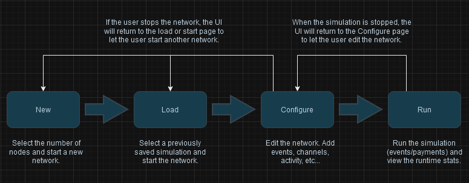

# CLI
The TUI consists of four main pages, each designed to facilitate different aspects of the simulation process:

1. **New Page:** This page allows users to create new simulations by inputting the number of each node type they would like in the simulation. This will start up the nodes and then pass control to the `Configure` page where the user can further set up the network and simulation.

2. **Load Page:** Users can load pre-existing simulations from this page, streamlining the process of accessing and reusing previous work. After the simulation is loaded the TUI will switch over the `Configure` page where the user can edit the loaded simulation if they would like.

3. **Configure Page:** On this page, users can modify various simulation parameters before execution, ensuring that each simulation can be tailored to specific needs. Users can add events and payment activity, open channels, view information about the nodes, etc. When the user is content with the simulation/network they can start the simulation and this will switch the TUI to the `Run` page.

4. **Run Page:** This final page enables users to execute their simulations, providing real-time feedback and output as the simulation runs. After the simulation ends the TUI returns to the `Configure` page where the user can inspect the network, re-run the simulation, or shutdown the network and start over.

Running BLAST simulations involves two parts: the network and the simulation. The network refers to the nodes and channels that make up the regtest Lightning Network. The simulation refers to the payment activity and the events. These parts are started/stopped independently, meaning the user can start up the network and make changes to the network before starting the payments and events. After the payments and events are run the simulation will stop but the network stays up so that the user can inspect the nodes and see how the payments and events impacted the network. At this point the user can either stop the network and start over or re-run the simulation on the network. This workflow promotes quick reproducibility and flexibility for the user. The BLAST TUI helps facilitate this process.

On the `Configure` page there is a CLI with the following commands:
| Command            | Description                                               |
|------------------  | --------------------------------------------------------- |
| `save`             | Save a simulation so that it can be loaded later.         |
| `add_activity`     | Add payment activity to the simulation.                   |
| `add_event`        | Add an event to the simulation.                           |
| `get_nodes`        | List all the node names currently running.                |
| `get_pub_key`      | Get the public key of a node.                             |
| `list_peers`       | List all the peers of a node.                             |
| `wallet_balance`   | Get the on-chain balance of a node.                       |
| `channel_balance`  | Get the off-chain blanace of a node.                      |
| `list_channels`    | List the channels of a node.                              |
| `open_channel`     | Open a channel between two nodes.                         |
| `close_channel`    | Close a channel between two nodes.                        |
| `connect_peer`     | Connect to another node.                                  |
| `disconnect_peer`  | Disconnect from another node.                             |
| `fund_node`        | Send on-chain funds to a node.                            |

