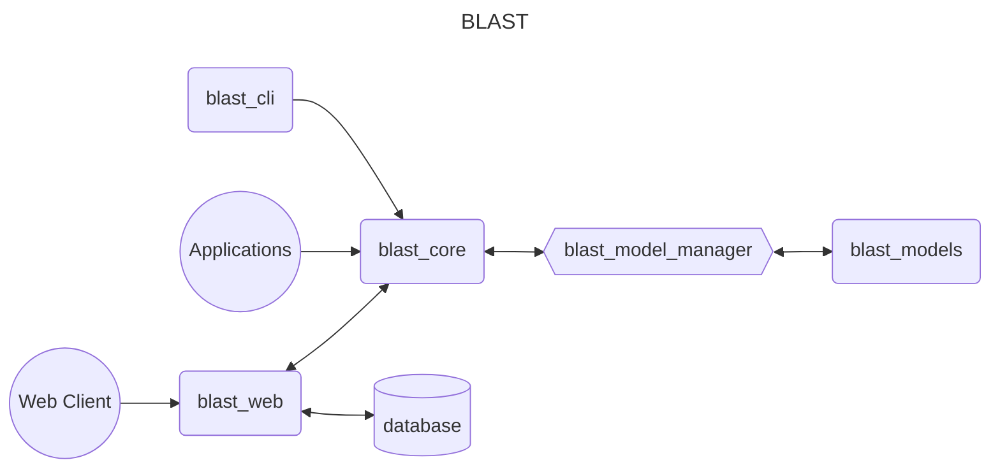
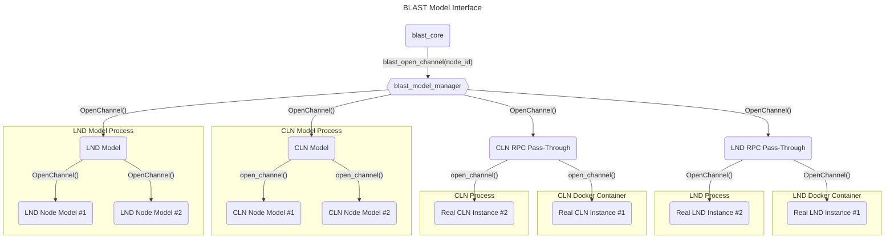

# BLAST Design Document
The idea is to create a library (`blast_core`) than can be used to start up large networks and automate test scenarios. The models (`blast_models`) can be developed independently and be plugged into BLAST by implementing the BLAST RPC [protocol](https://github.com/bjohnson5/blast/tree/main/blast_proto). By implementing that protocol the models can be controlled with the `blast_model_manager` so that automated scenarios can be run. The two user facing applications will be `blast_cli` and `blast_web`. Real nodes can also be manually connected to the network and controlled directly by the user during the scenarios, but in order for BLAST to handled automated operations the node must implement the BLAST RPC protocol.



## blast_core
This is the core simulation library. It handles creating the simulated network (nodes and channels) and then executes events on that network. Users can include this library in their application and get access to a library API for creating and running LN simulations.

## blast_cli
An example of an application that could use the `blast_core` library. Allows a user to run blast simulations from the command line.

## blast_web
This is the web application. This web server uses `blast_core` and exposes the simulation API to a web client so that a user can create and run simulations without having to write any code.

## blast_models
This directory holds all of the LN node models. A node model is a representation of a LN node. Models can be developed independently and then added to blast in this directory. Models can be written in any language and can run in a docker container or as a native process but they must implement the Blast RPC protocol (defined in `blast_proto`). The models can been seen as plugins to `blast_core` and could even be full LN implementations. Each model could be a manager that is managing all of the models of a particular node type or it could be a direct representation of just one node. Node models are defined using a json specification that tells the `blast_model_manager` how to use them. The `model.json` file defines how to start and communicate with the model. The `blast_model_manager` will load all models in `blast_models` directory that have a properly formatted `model.json` file in their root directory.

> If the user would like to connect a full node implementation to the simulation, they can run a docker with that instance and manually connect that to the simulation nodes. OR they can write an RPC server that implements the `blast_proto` protocol and handles passing the function calls through to the node.

## blast_model_manager
This is the connection between `blast_core` and `blast_models`. It is an interface library with an API that `blast_core` uses. It reads and parses the `model.json` files from the `blast_models` directory and stores that information. Then the core framework can simply make calls to the `blast_model_manager` and the interface will know how to communicate those calls to the corresponding model.

Example:

The `model.json` file for the blast LND model
```json
{
    "name": "blast_lnd",
    "rpc": "localhost:50051",
    "start": "blast_lnd"
}
```

The `blast_core_interface` `open_channel` function will look up the node id that is passed in, find the correct RPC connection details and execute the RPC call.

In theory, you could put a full LND node implementation in the `blast_models` directory, define a `model.json` file, and write a pass-through RPC server that takes `blast_proto` RPCs and connects those RPC calls to the actual RPC calls defined in LND and run a simulation using the real LND code. In this situation you would be able to include this full node in `blast` simulation events.

However, you could also build an LND manager and smaller lightweight LND instances that the manager controls. Then you could connect the core library to the manager and all LND nodes created by the simulation would execute inside the managers process. The `blast_model_manager` would make RPC calls to the manager and the manager will control the child nodes.


In this example, `blast_core` simply calls `blast_open_channel` with a given `node_id`. The `blast_model_manager` looks up what model this node belongs too and finds the correct RPC connection. It then calls `OpenChannel()` (which is a blast specific RPC) on the correct model. Each model must have `OpenChannel` implemented. The model then processes that RPC call because it knows how to open a channel on one of its child nodes. For a CLN node this might be `open_channel`, for an LND node this might be `OpenChannel`.

The model (or RPC pass through) is responsible for operating its child nodes.

The `blast_model_manager` is used by `blast_core` directly and by the simulation events to make operations on the nodes.
