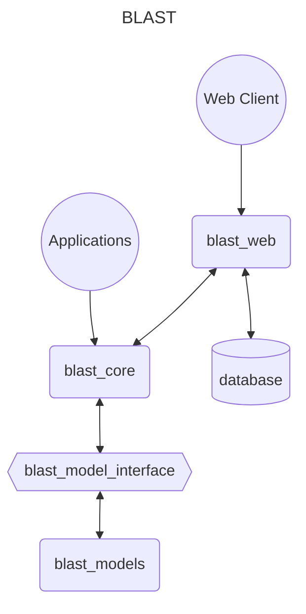
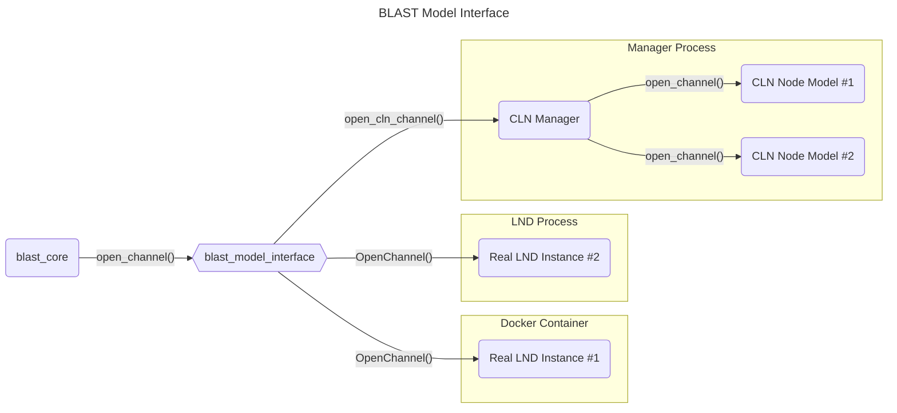

# BLAST Design Document


## blast_core
This is the core simulation library. It handles creating the simulated network (nodes and channels) and then executes events on that network. Users can include this library in their application and get access to a library API for creating and running LN simulations.

## blast_web
This is the web application. This web server uses `blast_core` and exposes the simulation API to a web client so that a user can create and run simulations without having to write any code.

## blast_models
This directory holds all of the LN node models. A node model is a representation of a LN node. Models can be developed independently and then added to blast in this directory. Models can be written in any language and can run in a docker container or as a native process but they must implement some kind of RPC protocol. The models can been seen as plugins to `blast_core` and could even be full LN implementations. Each model could be a manager that is managing all of the models of a particular node type or it could be a direct representation of just one node. Node models are defined using a json specification that tells the `blast_model_interface` how to use them. 

The `model.json` file defines how to build, start, and communicate with the model. It defines the RPC API (open channel, stop node, generate invoice, etc..), how to build the model, how to start the model, and whether the model is a manager or direct node.

### direct models
If the model is a `direct` node model the RPC calls should all go directly to the node.
> Each node will run in its own process and have its own rpc connection

### manager models
If the model is a `manager` node model the RPC calls should go to the manager and they should specify which node the call is meant for.The manager can then make the correct action on the correct node
> All nodes will run in one process

## blast_model_interface
This is the connection between `blast_core` and `blast_models`. It is an interface library with an API that `blast_core` uses. It reads and parses the `model.json` files from the `blast_models` directory and stores that information. Then the core framework can simply make calls to the `blast_model_interface` and the interface will know how to communicate those calls to the corresponding model.

Example:

The `model.json` file for a `direct` LND model
```json
{
    "name": "lnd_node",
    "type": "direct"
    "open_channel": {
            "method": "OpenChannel",
            "params": ["OpenChannelRequest"]
        }
}
```

The `model.json` file for a `manager` CLN model
```json
{
    "name": "cln_manager",
    "type": "manager"
    "open_channel": {
            "method": "open_cln_channel",
            "params": ["node_id", "destination", "amount"]
        }
}
```

The `blast_core_interface` `open_channel` function will look up the node id that is passed in, find the correct RPC connection details and method name for that node and execute the JSON-RPC call.

In theory, you could put a full LND node implementation in the `blast_models` directory and define a `model.json` file that connects the JSON-RPC calls to the actual RPC calls defined in LND and run a simulation using the real LND code.

However, you could also build an LND manager and smaller lightweight LND instances that the manager controls. Then you could connect the core library to the manager and all LND nodes created by the simulation would execute inside the managers process. The `blast_model_interface` would make JSON-RPC calls to the manager and the manager will control the child nodes.


