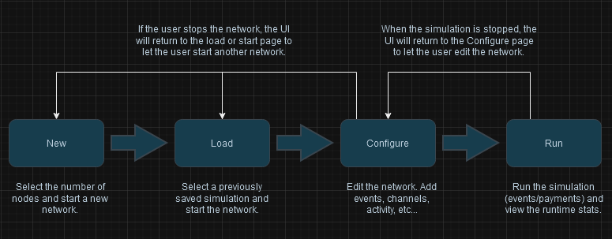

Running BLAST simulations involves two parts: the network and the simulation. The network refers to the nodes and channels that make up the regtest Lightning Network. The simulation refers to the payment activity and the events. These parts are started/stopped independently, meaning the user can start up the network and make changes to the network before starting the payments and events. After the payments and events are run the simulation will stop but the network stays up so that the user can inspect the nodes and see how the payments and events impacted the network. At this point the user can either stop the network and start over or re-run the simulation on the network. This workflow promotes quick reproducibility and flexibility for the user. The BLAST TUI helps facilitate this process.

