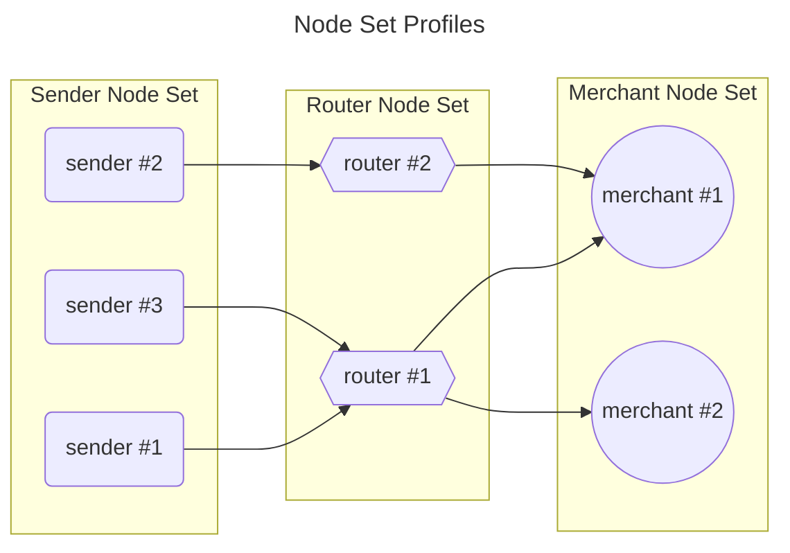

# Node Set Profiles

```mermaid
---
title: Node Set Profiles
---
flowchart LR
    sender1(sender #1)
    sender2(sender #2)
    sender3(sender #3)

    router1{{router #1}}
    router2{{router #2}}

    merchant1((merchant #1))
    merchant2((merchant #2))

    subgraph Sender Node Set
    sender1
    sender2
    sender3
    end

    subgraph Router Node Set
    router1
    router2
    end

    subgraph Merchant Node Set
    merchant1
    merchant2
    end

    sender1-->router1-->merchant1
    sender2-->router2-->merchant1
    sender3-->router1-->merchant2
```