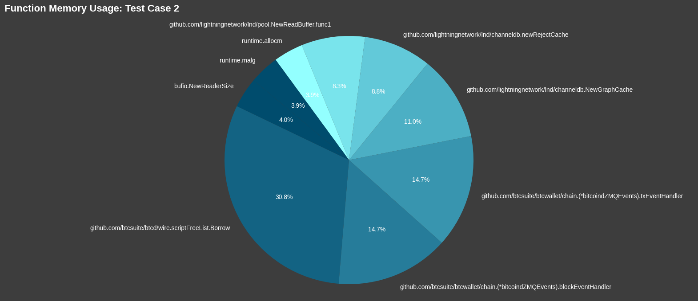
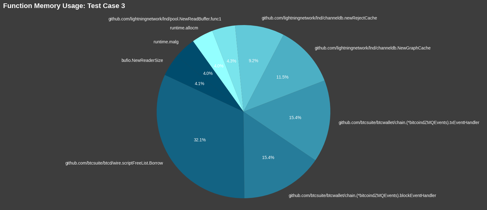
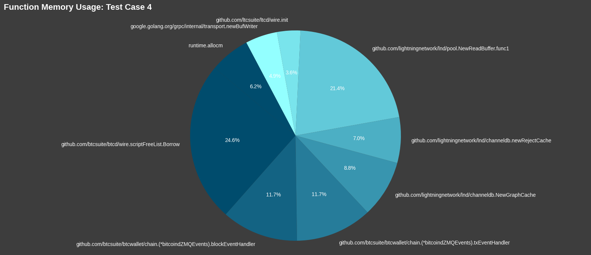
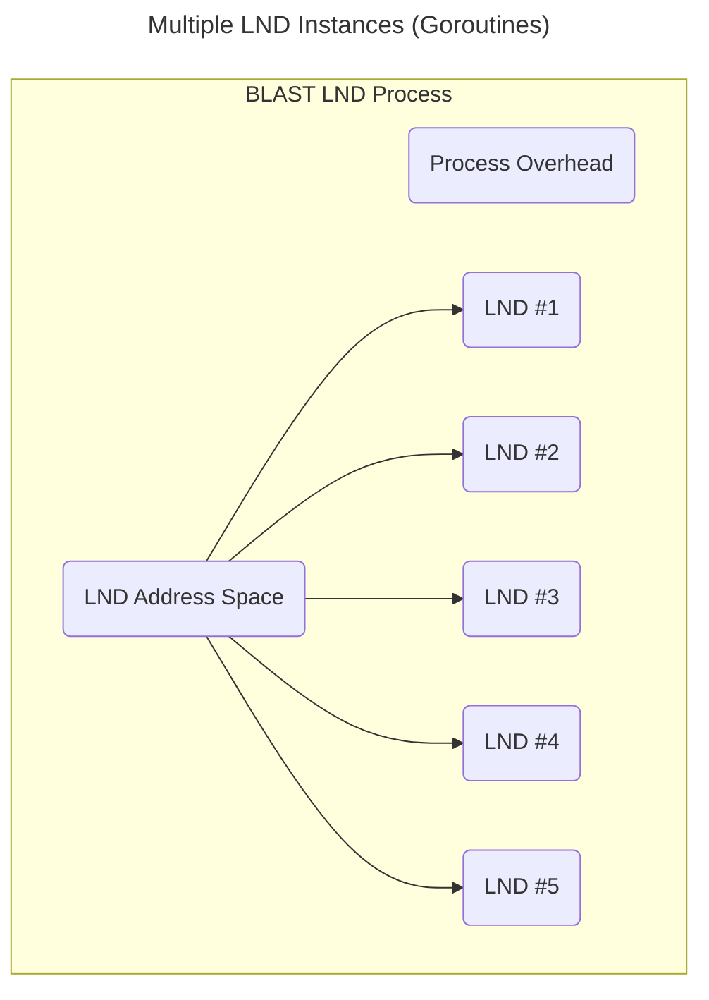
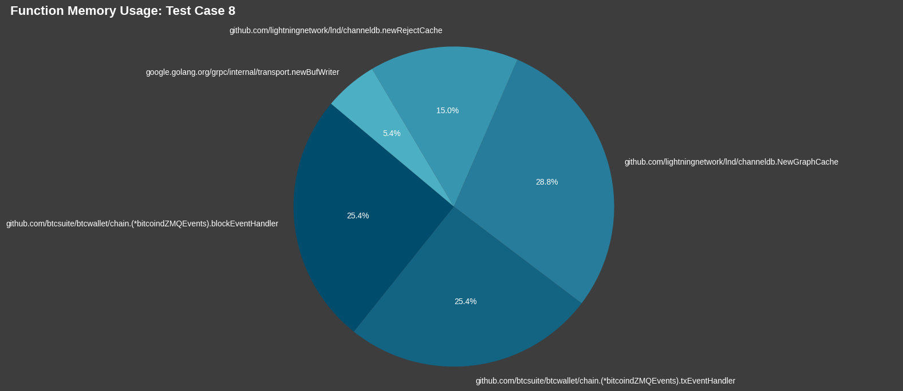

# LND Profiling
The ultimate goal of `blast` is to allow users to create large scale test networks. To enable large networks we need highly efficient and lightweight nodes, so that many of them can be run at the same time. In order to create lightweight nodes, analysis must be done to gain an understanding of how lightning node software uses resources.

For starters we will be analyzing `lnd` and designing a lightweight model that accurately represents this implementation. We will start by determining which parts of `lnd` use the most resources. In addition, we need to know how different situations impact the resource usage. `lnd` is written in `go`, meaning that it has lots of built in performance tools that we can use to gain a better understanding of the system. Using `pprof`, we can see what functions allocate the most memory and which ones could potentially be altered to use less memory in a simulation environment. The general approach of `blast` is to find parts of LN node implementations that are not important in a testing use case and tweak those parts to use less resources so that large test networks can be created.

## TEST CASE 1 - Idle `lnd` instance with 0 channels
The first test case we ran is simply 1 `lnd` instance running with no peers, no channels, no balance. This is just an empty, freshly created `lnd` node. Using `pprof` we can examine the in-use memory and see which functions are responsible for allocating it.

discuss pie chart

## TEST CASE 2 - Idle `lnd` instance with 5 channels
Next, we open up some channels and see what happens to our in-use memory.

discuss pie chart

## TEST CASE 3 - Idle `lnd` instance with 9 channels
Opening more channels does not seem to impact the in-use memory too much. This test case returned similar results as [Test Case 2](#test-case-2---idle-lnd-instance-with-5-channels).

discuss pie chart

## TEST CASE 4 - Idle `lnd` instance with 30 channels
Opening more channels does not seem to impact the in-use memory too much. This test case returned similar results as [Test Case 2](#test-case-2---idle-lnd-instance-with-5-channels).

discuss pie chart

## TEST CASE 5 - `lnd` instance during the process of opening 30 channels
Now we wanted to see if the in-use memory changed if we profiled `lnd` while it was in the process of opening channels. Again, the results were very similar to [Test Case 2](#test-case-2---idle-lnd-instance-with-5-channels).

discuss pie chart

## TEST CASE 6 - `lnd` instance while processing transactions
Then we profiled `lnd` while it was receiving transactions and the in-use memory still remained relatively the same.

discuss pie chart

## TEST CASE 7 - `lnd` instance while processing more transactions
Even when we increased the number of transactions the in-use memory remained constant.

discuss pie chart

## Using goroutines to run multiple `lnd` instances
After testing a single `lnd` instance in several situations and getting a good idea about what the memory requirements are, we starting spinning up more than one instance. One benefit of `lnd` being written in `go` is that `goroutines` are an efficient way to handle concurrency. `blast` will leverage `goroutines` to start multiple `lnd` nodes instead of running multiple nodes as separate processes. This will help save on host resources and give `blast` more control over each node.

In general, starting a new thread within a process is typically more memory-efficient than starting a new process in Linux. A few reasons why:

1. Creating a new process involves duplicating the entire address space of the parent process, including code, data, and stack segments. This incurs a significant memory overhead because each process has its own memory space. On the other hand, threads within a process share the same address space, including code and data segments, which results in less memory overhead.

2. Context switching between threads within the same process is generally faster than between processes because the kernel doesn't need to perform memory mapping for different address spaces. Context switching between threads usually involves switching the CPU registers and stack pointers, which is faster compared to the overhead of switching between processes.

3. Threads within the same process share resources such as file descriptors, memory allocations, and other operating system resources, which can lead to better resource utilization compared to separate processes.

`goroutines`, a concurrency primitive in the Go programming language, are often more efficient than threads in traditional operating systems for several reasons:

1. `goroutines` are lightweight compared to threads. They have smaller stack sizes by default (a few kilobytes), which reduces the memory overhead per concurrent task. This allows Go programs to efficiently handle large numbers of concurrent tasks without consuming excessive memory.

2. `goroutines` are designed to have fast context switching. Switching between goroutines involves changing the stack and program counter, which is faster than the context switching overhead of traditional threads in many cases. This efficiency is achieved through cooperative scheduling managed by the Go runtime, which avoids the overhead of preemptive context switches used in traditional threading models.

3. Go's garbage collector is optimized for concurrent execution and works seamlessly with `goroutines`. It can efficiently reclaim memory allocated by `goroutines` without causing significant pauses or overhead.

## TEST CASE 8 - 100 `lnd` instances
For this test case we start up 100 instances of `lnd`, each in its own `goroutine`. We can see that the top memory users are still consistent with our test cases with just one `lnd` instance.

discuss pie chart

## TEST CASE 9 - 100 `lnd` instances with no caching
Now we can start tweaking the `lnd` code to use less memory. Because there are several caches that are using the most memory, turning those caches off lowers the amount of in-use memory.

discuss pie chart

## TEST CASE 10 - 100 `lnd` instances with no caching and using Neutrino
The ZMQ event handlers that are used to get information from the base layer are also top memory consumers. In order to free up that memory we can switch over to use Lightning Labs `Neutrino` option.

`Neutrino` is designed to provide a lightweight, privacy-preserving way for Bitcoin wallets and applications to interact with the Bitcoin blockchain. `Neutrino` clients download only a fraction of the Bitcoin blockchain data, typically starting from a recent block and syncing forward. This contrasts with full nodes, which download and validate the entire blockchain from the genesis block. `Neutrino` clients achieve this by using filters called "Bloom filters" to request only relevant transactions from Bitcoin full nodes.

discuss pie chart

## Startup allocations vs running allocations
After running all of these tests and starting up multiple `lnd` nodes on the same machine we noticed that the memory requirements for a up-and-running node are not too intensive (especially when running as `goroutines`). However, during the startup of a node a large amount of memory is allocated and then returned to the operating system. 

When using the `pprof` tool you can use the `-inuse_space` flag or the `-alloc_space` flag:

- `-inuse_space` shows the total number of bytes currently allocated (live objects, not garbage collected or released back to the OS)
- `-alloc_space` shows the total number of bytes allocated since the program began (including garbage-collected bytes)

All of the previous test cases were using the `-inuse_space` flag. If we switch to using the `-alloc_space` flag we can see what functions are allocating memory during the startup process.

## TEST CASE 11 - 100 `lnd` instances with `-alloc_space` flag (create wallet)
This test starts up 100 nodes with no caches and the `neutrino` option turned on. These 100 nodes are starting up for the first time so they are creating new wallets.

In our test case we start up 10 nodes, sleep for 10 seconds, and then start up 10 more nodes. We can see the memory usage jump every 10s here:

`pprof` shows us that `scrypt.Key` function allocates 102GB over the course of starting up the 100 nodes.

discuss pie chart

## TEST CASE 12 - 100 `lnd` instances with `-alloc_space` flag (open existing wallet)
This test starts up 100 nodes with no caches and the `neutrino` option turned on. These 100 nodes are starting up for the second time, so they are simply opening an existing wallet.

When the nodes are only opening a wallet the `scrypt.Key` functions allocates roughly half as much memory (50GB) while starting up 100 nodes.

discuss pie chart

## Sharing a Lightning Wallet between nodes

## TEST CASE 13 - 100 `lnd` instances with `-alloc_space` flag (shared wallet)
This test starts up 100 nodes with no caches and the `neutrino` option turned on. These 100 nodes are using the same wallet.

When using the shared wallet we no longer see those big memory usages jumps like we did in [Test Case 11](#test-case-11---100-lnd-instances-with--alloc_space-flag-create-wallet)

And we can see that the `scrypt.Key` functions only allocates 1024MB while starting the 100 nodes.

discuss pie chart

## The `scrypt.Key` function memory allocations during startup

Here is a graph showing the decline in memory usage at startup for test cases 11, 12, and 13

discuss pie chart
