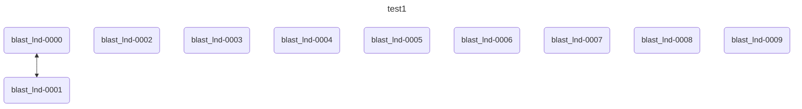
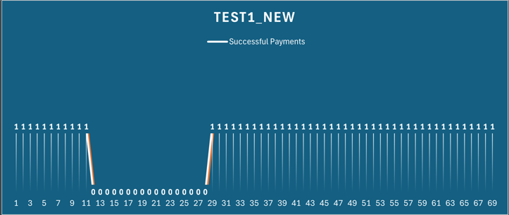
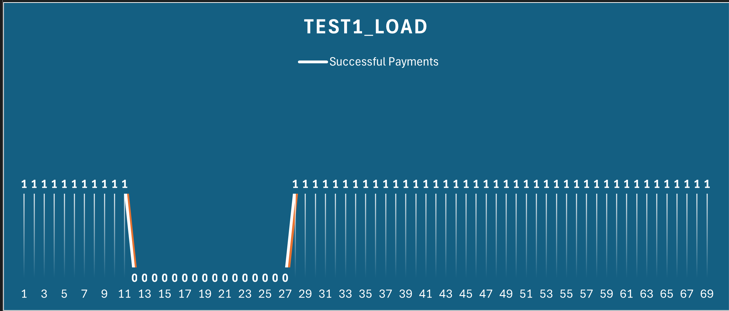
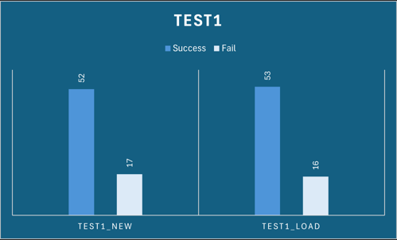
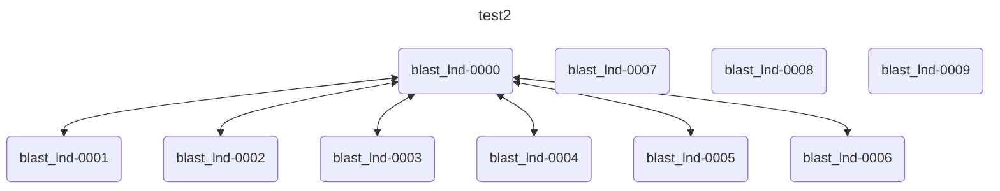
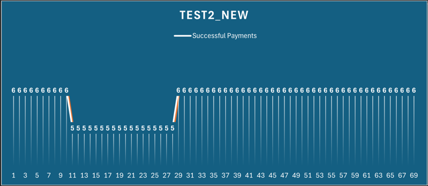
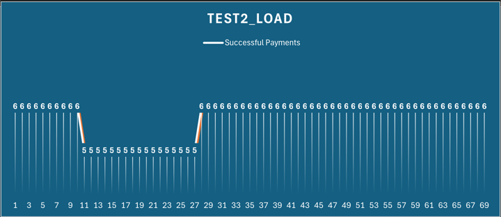
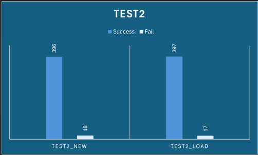

# Reproducible Simulations
The ultimate goal of `blast` is to allow users to create large scale test networks that can be automated and easily reproduced. To enable this, we need to develop ways of saving a test network state and quickly loading that state back so that the same simulation can be repeated. For starters we will save off the bitcoind and lightning data directories so that when nodes are started up they load the saved network state. This is a simple way to get some basic save/load functionality in BLAST. The core BLAST library will handle saving the bitcoind state, events, and payment activity and each model will be responsible for saving its state when it gets a `BlastSaveRequest` from the core framework. Here are the things that will be saved off and loaded back to enable simulation reproducibility:

- Lightning data directories for all nodes (saved by the model controlling those nodes)
- The bitcoind data directory
- The sim-ln data (node connection details and payment activity)
- The BLAST simulation events

By saving these things and loading them at a later time a simulation can be run as many times as neccessary and will produce the same results. This can be seen using the `blast_example` application. The `blast_example` application starts up a network of LND nodes, funds the nodes, opens channels, connects to peers, adds events and payments and then saves the state of the network. After saving, the simulation is run. During the run the node balances, channels, peers, etc will change. However, then the `blast_example` can be run again and load the saved state and it will produce the same results as the first run.

To run the `blast_example` application:

```bash
./run_example.sh
```

This will run two simulations with different network details and save each of them in `/home/blast_sims`.

## Test Case 1
The first simulation that `blast_example` will create and run is called `test1`. Here are the details of that simulation:

### Events:
| Time    | Event        |
| ------- | ------------ |
| 10      | CloseChannel |
| 23      | OpenChannel  |

### Activity:
| Source         | Destination    | Start | Count | Interval | Amount (ms) |
| -------------- | -------------- | ----- | ----- | -------- | ----------- |
| blast_lnd-0000 | blast_lnd-0001 | 0     | null  | 1        | 2000        |

### Network


### Results
Running `test1` for the first time shows that payments between `blast_lnd-0000` and `blast_lnd-0001` are successful until the channel is closed by the `CloseChannel` event at 10 seconds. The payments then fail until the another channel is opened with the `OpenChannel` event at 23 seconds. This graph shows the number of successful payments at each time throughout the simulation. We can see that the number of successful payments drops to 0 around the 10 second mark and then after the new channel is opened and confirmed the number of successful payments jumps back up to 1.



After the first simulation finishes we can re-run it by running the `blast_example` application with a command line argument specifying the simulation to load:

```bash
./run_example.sh test1
```

The results of this loaded run match up with the first run.



We can see that running the example from scratch, saving it, loading it, and running it again produces the same simulation results.



## Test Case 2
The second simulation that `blast_example` runs has several more channels and makes more payments. It has the same events that will close/open the channel between `blast_lnd-0000` and `blast_lnd-0001`.

### Events:
| Time    | Event        |
| ------- | ------------ |
| 10      | CloseChannel |
| 23      | OpenChannel  |

### Activity:
| Source         | Destination    | Start | Count | Interval | Amount (ms) |
| -------------- | -------------- | ----- | ----- | -------- | ----------- |
| blast_lnd-0000 | blast_lnd-0001 | 0     | null  | 1        | 2000        |
| blast_lnd-0000 | blast_lnd-0001 | 0     | null  | 1        | 2000        |
| blast_lnd-0000 | blast_lnd-0002 | 0     | null  | 1        | 2000        |
| blast_lnd-0000 | blast_lnd-0003 | 0     | null  | 1        | 2000        |
| blast_lnd-0000 | blast_lnd-0004 | 0     | null  | 1        | 2000        |
| blast_lnd-0000 | blast_lnd-0005 | 0     | null  | 1        | 2000        |
| blast_lnd-0000 | blast_lnd-0006 | 0     | null  | 1        | 2000        |

### Network


### Results
We can see similar results with this second test simulation.



After the first simulation finishes we can re-run it by running the `blast_example` application with a command line argument specifying the simulation name to load:

```bash
./run_example.sh test2
```

The results of this loaded run match up with the first run.



We can see that running the example from scratch, saving it, loading it, and running it again produces the same simulation results.


